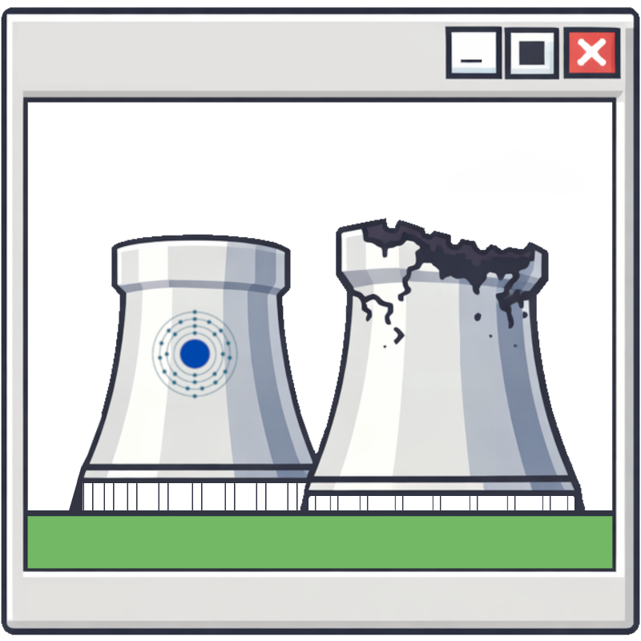

  
  
  
  

# buttslap

  

### I am a Rust Rust developer. I survived the survival game, now I'm surviving by writing survival software.

Tools for [Rust](https://rust.facepunch.com/) the game, written in [Rust](https://www.rust-lang.org/) the language.

> **buttslap is not affiliated with, endorsed by, or connected to Facepunch Studios in any way.**
> Rust is a registered trademark of Facepunch Studios.

---

# The Manifesto

I'm one developer. I built **PowerPlant**, a desktop companion application for Rust that does more than the existing tools combined.

### This isn't a startup pitch. This is a promise.

---

# To The Competition

I noticed you charge money for software that crashes. I noticed your "real-time" maps update every 30 seconds. I noticed you gate basic features behind paywalls and call it a "business model."

I noticed your "AI-powered" answers. **Your AI takes 20 seconds to deliver a hallucination.** A player asks "how much C4 for a stone wall?" and your system calls an API and returns an answer that sounds authoritative and is completely wrong. You bolted a language model onto a search index and called it innovation.*

Here's what PowerPlant does instead. A state-of-the-art knowledge base:

> **0.3 seconds. Deterministic. Verified.**
>
> The answer comes from a structured knowledge base. Not generated, not guessed, not "most likely." Every number is looked up from verified game data. The system *cannot hallucinate* because it doesn't generate text. It retrieves facts.
>
> 
Ask "how much charcoal for a rocket" and you get the exact recursive material breakdown in 0.3 seconds. Before your bot even starts thinking.

## Innovate or go out of business

### My free tier alone will offer what most of you gate behind a monthly subscription. Adjust accordingly.

*I put my data where my mouth is. I've started pushing updates to the [Facepunch wiki](https://wiki.facepunch.com/rust/~recentchanges) patch by patch, with thousands of pages coming soon. See [Giving Back](#giving-back).

---
# PowerPlant

  

# What PowerPlant Does

I won't list every feature here. I don't want the competition getting ideas before launch. 
But I can tell you about **some** game-changing ones.

PowerPlant milks the Rust+ Protocol to its maximum capacity, providing a strong foundation for mind-blowing features like:

---

### Location Intelligence

*While the competition is struggling to give you an accurate grid coordinate...*

The Location Intelligence service speaks human:

- **"Teammate X died 100 meters south of Launch Site"**
- **"Player traveled from team territory towards Mining Outpost and came back"**
- **"Your last death was between Mining Outpost and Oxum's Gas Station"**

No grid squares. No coordinates you have to decode. Semantic, human-readable descriptions of what happened and where.

You can also save a stash position or your current location, and the system guides you back to it in real time: *"Move 5 meters south, 10 meters east"*. GPS navigation, but for Rust.

---

### Market Intelligence

Searchable vending machines? Everyone has that.

**Arbitrage Detection** - The system continuously monitors every vending machine on the server. When it finds price discrepancies between sellers, you get notified instantly. Be a happy merchant. Buy low, sell high, let the software do the math.

**Trade Routes** - You have Resource X and want Item Y, but nobody sells it directly. PowerPlant calculates the cheapest multi-hop trade path across every vending machine on the server to get you there.

**Outpost Transfer Meta Detection** - This is where it gets **nasty**. Players use the Outpost drone system to transfer high-value items to themselves: list an AK for a low-value item at their own vending machine, fly the drone from Outpost, buy it, done. PowerPlant sees all of it.

I built a **real-time, data-driven currency model** called **Cobalt**. Massive amounts of market data gathered across official servers. Every item has a parity weight. When someone lists a high-value item for a low-value item, PowerPlant doesn't just notice. **It notifies you in 300 milliseconds.** Fast enough to buy the item before the intended recipient can even navigate to the drone terminal.

This isn't a dumb threshold check. This is a full economic model driven by real trade data.

*Cobalt-driven slave market. Coming soon.*

---

### Territory & Waypoints

Hook your auto turrets and HBHF sensors directly to the map inside your team territory. With PowerPlant open on a second monitor, you can **see the direction enemies are approaching from in real time**, before they even reach your walls.

Draw territory boundaries, drop stashes, mark points of interest. Everything is shared with the team and plugged into [Location Intelligence](#location-intelligence), so the system can describe positions relative to your markers and guide teammates to any point on the map.

---

### Replay System

Replay arbitrary time spans from your play sessions. Scrub through your team's movement history. Study fight patterns, reconstruct raids, analyze patrol routes, review raid defenses. Your team's black box recorder.

---

### Clan Intelligence

Track enemy clans on the server. Add individual members, draw their territory, study their online/offline patterns through activity heatmaps.

Detect when the entire enemy clan suddenly comes online at 3 AM. They're probably planning to offline raid you. Detect when they're all offline. Opportunity knocks. Hook [Notifications](#notifications) into any pattern you care about.

---

### Team Missions

Play Rust like a real-time strategy game. As a clan leader, use the interactive map with team management and the mission system, all backed by [Location Intelligence](#location-intelligence).

Put a marker on the map: "go here, collect wood." Assign scouts to an area. Coordinate your team without micromanaging. Select your crew, send them on tasks, track progress.

---

### Notifications

Desktop notification? Got it. SMS? Got it. **An AI phone call telling you you're getting raided?** Got it.

Each notification source can be routed to its own consumer: this HBHF sensor sends a Discord alert, that smart alarm triggers an SMS, the base alarm calls your phone.

**Bonus:** Hook a notification to an auto-connect event. If you're offline and the system calls to wake you up, PowerPlant launches, auto-joins the server the alert came from, and by the time you're at your desk you're already loaded in. Open the map, check the [sensors](#territory--waypoints), you already know where they're coming from.

---

### Smart Device Control

Toggle switches, monitor alarms, control electrical systems. Build electricity logic inside the software that acts on the game.

---

### Team Chat & Bot Commands

Full Rust+ team chat integration. Built-in bot with translations, device control, and instant knowledge queries. Toggle your [smart devices](#smart-device-control) directly from in-game chat.

---

### Server Discovery

Common sense filters that actually work. Faster than the in-game browser.

---

# The Knowledge Base

This is where the gap becomes a canyon.

PowerPlant sits on top of the **largest structured Rust game database available to any tool.**

Every answerable question about the game: crafting recipes, recycling yields, repair costs, raiding data, protection stats, nutrition, loot sources, electrical specs. Answered in 0.3 seconds. Deterministic. Verified. The system *cannot* be wrong because it doesn't guess.

---

## Giving Back

I'm open-sourcing the entire knowledge base. The full structured dataset AND the generator pipeline that produces it. Anyone can use it, contribute to it, or build on top of it.

I've also started pushing updates to the [official Facepunch Rust wiki](https://wiki.facepunch.com/rust/~recentchanges). Thousands of page improvements, standardized templates, generated item icons. Patch by patch, getting it up to date.

This data lives in a git repository. Contribute fixes, regenerate, push. Open collaboration, not walled gardens.

---

# Free vs. Pro

### The public beta free tier will already ship with most of the features the "competition" locks behind a $6/month subscription.

Four tiers:

| Tier | What it means |
|------|---------------|
| **Free** | The product. Not a demo, not a trial. |
| **Guest** | Invited by a paid user. Full ride. |
| **Basic** | Most features. Cheap. |
| **Pro** | The game-breaking stuff. For the sweaty tryhards. |

I hesitated to create multiple tiers. But the philosophy is simple: let the dedicated players who want every competitive edge fund the experience for the rest of the community. The noobies play for free. The tryhards pay, and they get features worth paying for.

---

# Current Status

## Closed Beta

**Testers:** No longer accepting

**Next:** Public beta, free tier

**Platform:** Built on Linux. Works on Windows and macOS.

---

# License

Absolutely Proprietary software. Not open source.

---

# What PowerPlant is NOT

**Not a corporation.** One developer. I don't sell your data. I don't harvest your data. I don't care about your data. I care about making the best tool for the game.

**Not a cheat.** I fucking hate cheaters. PowerPlant intentionally respects the Rust+ protocol's intended limitations. For example, you cannot view an in-game camera feed while connected to the game. Yes, there are workarounds. I don't use them. I adhere to the intended use of the protocol, full stop.

I'm a cybersecurity specialist with 20 years of experience in the field. If Facepunch ever wants help with cheater detection, I'll do it for free.

---

  Built by one developer who got bored.
   
  Shipping soon. Stay tuned.

